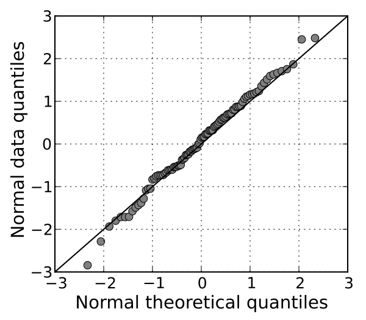

Visualizing Data by William S.Cleveland

# Univariate data
## Q-Q plot
2機率分布(probability distributions)變數繪製 quantile 互相比較


## Tukey Mean-Difference Plot
2變數差與兩變數平均值之間的差異繪製

# Bivariate data
典型兩變數的關係可以想成 “Response on a Factor”

## Smooth Curve and Banking
### Loess curve
看scatter 的趨勢或猜測未測量的數值可能為何
> short for local regression

> one of many curve fitting methods... easy to compute and easy to use

## Fitting: Parametric and Loess
### Parametric 
#### fitting a line
> x as the measurement of factor; y as the response 
$$y=a+bx$$
#### Quadratic polynominal
$$y=a+bx+cx^2$$
#### least-squares
 > to minimize the sum of the squares of the vertical deviations of the data
$$\sum_{i=1}^n (y_i-a-bx_i)^2$$
