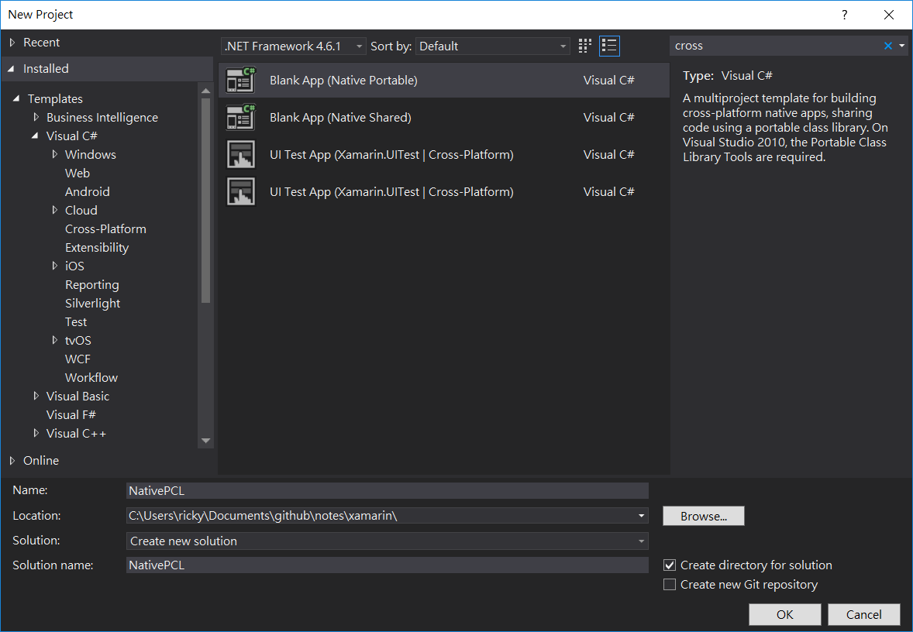

# new native app
- 

- iOS starting point 
    - 

- Compiling with major minor error in Droid [ref fix](http://stackoverflow.com/questions/36457947/java-lang-unsupportedclassversion-error-in-xamarin-studio)

    - download the latest JDK to solve this problem. 
        - Double-check that Java JDK 8 is selected in the Xamarin preferences:
            - Visual Studio: Tools > Options > Xamarin > Android Settings > Java Development Kit Location.
            - Xamarin Studio (on Mac): Xamarin Studio > Preferences > Projects > SDK Locations > Android > Java SDK (JDK).
    - remove old SDK in case java version confusion
    - remove all outdated API 24 packages from Android SDK Manager
    

# About BLE app
- design based on chip
- 