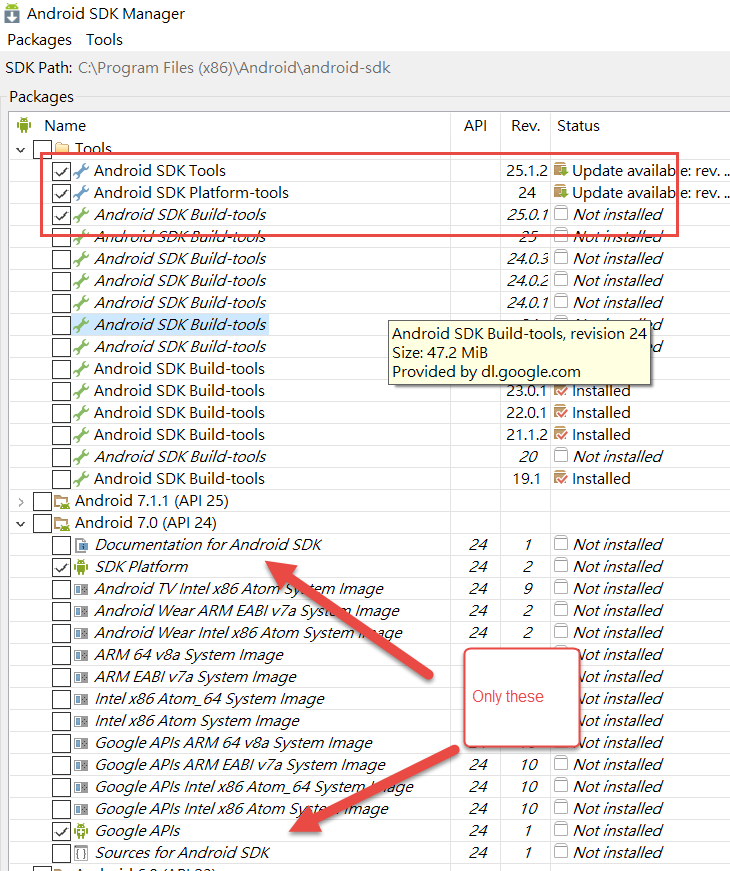
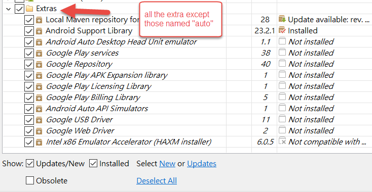

# [workbooks](https://developer.xamarin.com/guides/cross-platform/workbooks/) 
>Provide a blend of documentation and code that is perfect for experimentation, learning, and creating guides and teaching aids.

>Create a rich C# workbook for Android, iOS, Mac, WPF, or Console, and get instant live results as you learn these APIs. 
- cross platform
- documentation
- develope tool

# shared code
## PCL - Portable Class Library
- high Portable
- Only common API will be used
- Use this instead shared project to avoid some complicated problems
## Shared Project
- all the API can be shared

> I personally perefer PCLs because the code is much easier to read without any compiler directives. Using MVVMCross you are able to use plenty of plugins via NuGet. So you don't need to write your own classes for camera access, showing alerts etc.
quoted from [stakeoverflow: Xamarin Shared Library and PCL](http://stackoverflow.com/questions/32043793/xamarin-shared-library-and-pcl)
# installation
## android sdk manager
- don't install unnecessary stuffs
    - 
    - 

# Background Knowledge
- LLVM
- NDK

# [Native PCL demo](NativePCL/readme.md)